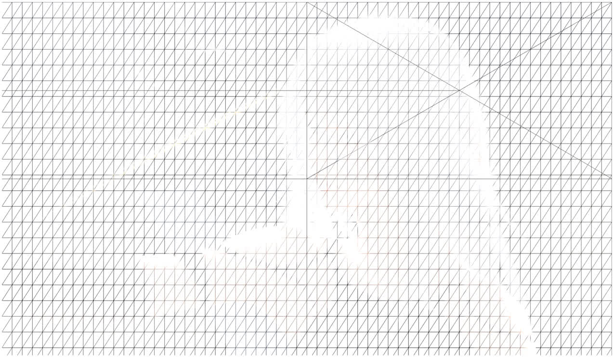
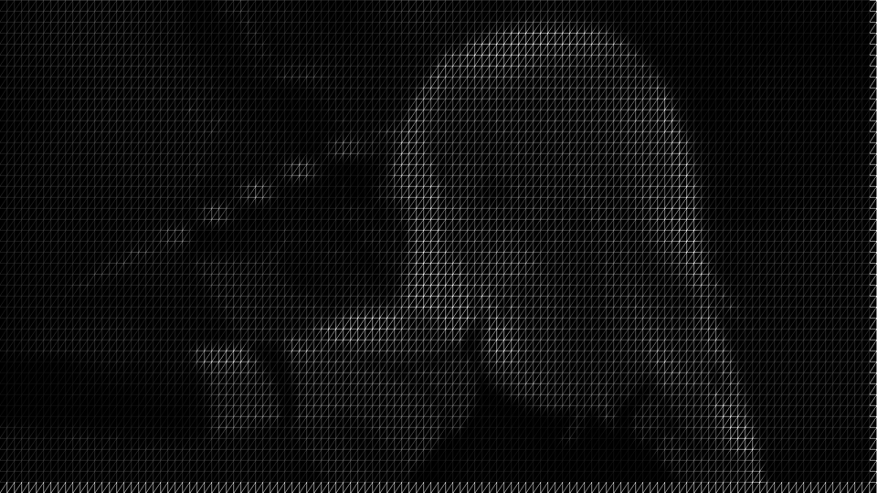
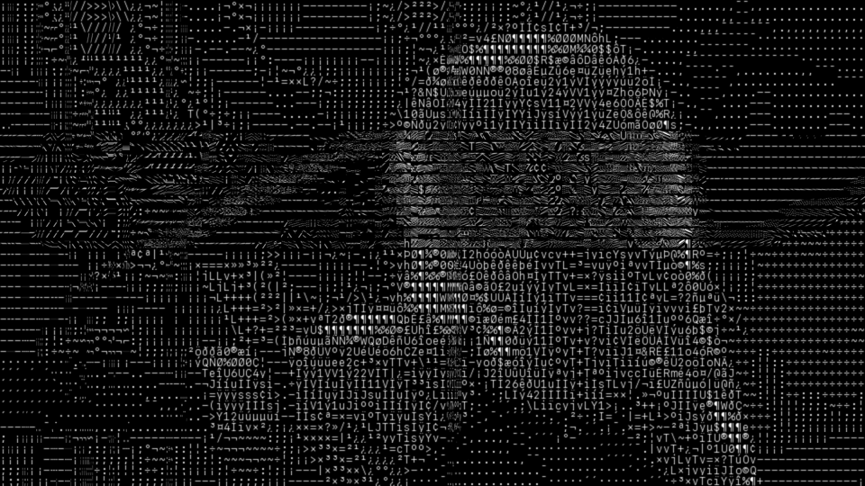
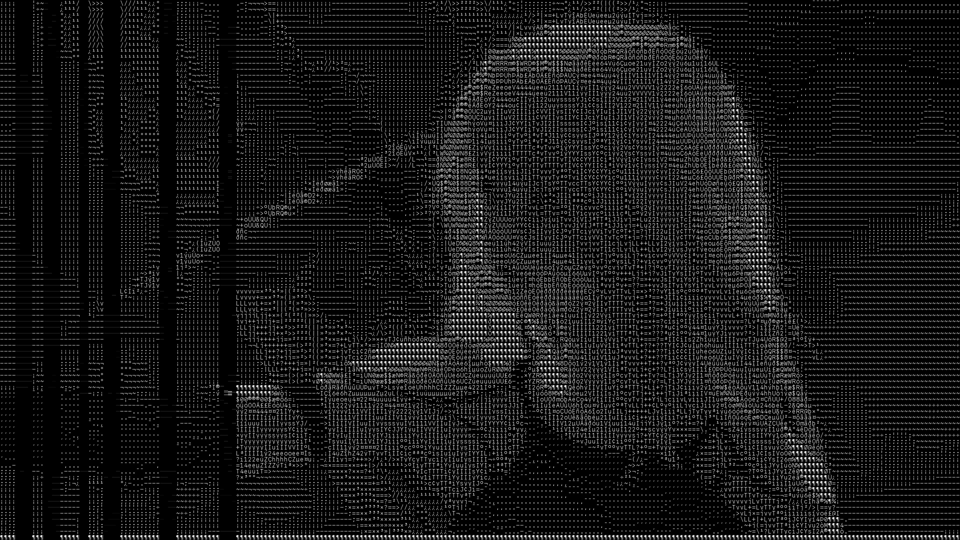
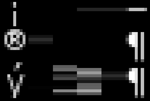
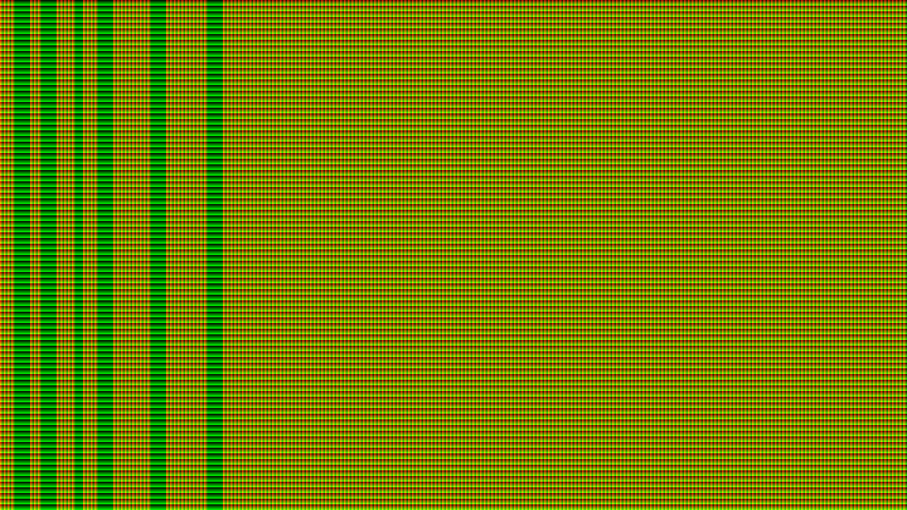
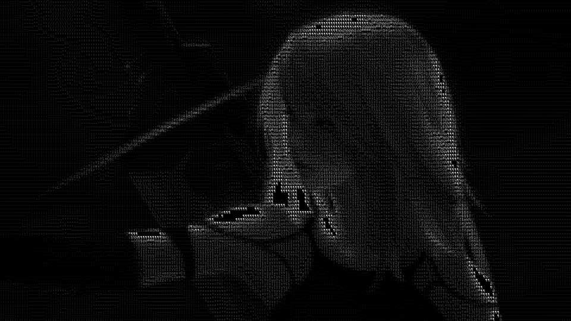
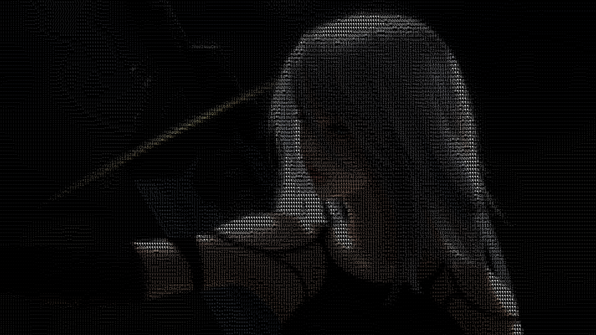

# 2023年5月31日

尝试使用cmake生成一个UI程序，比较困难，网上缺少例子。参考GitHub代码：

[Simple iOS Application with iPad and iPhone storyboards.](https://github.com/forexample/testapp)<br>
[CMake Build Configuration for iOS](https://github.com/sheldonth/ios-cmake)

# 2023年6月1日

cmake生成一个MacOS端的GUI程序实在是太困难了，网上没有找到合适的代码，基本都是iOS + cmake的。使用以下代码可以编译，但无法显示UI窗口。目测主要的问题是没有找到方案可以添加并编译Main.storyboard。
``` cmake_minimum_required(VERSION 3.14)
project(SimplePlayer VERSION 0.0.1)

# 设置C++编译器
set(CMAKE_CXX_COMPILER "clang++")

# 设置C++标准
set(CMAKE_CXX_STANDARD 17)

# 收集当前目录下的所有cpp文件
file(GLOB SDK_FILES src/*)

# 添加资源文件
set(RESOURCE_FILES
    src/Main.storyboard
)

# 添加可执行文件并将所有cpp文件链接起来
add_executable(${PROJECT_NAME} MACOSX_BUNDLE ${SDK_FILES} ${RESOURCE_FILES})

target_sources(${PROJECT_NAME} PRIVATE ${RESOURCE_FILES})

# 添加依赖库
target_link_libraries(${PROJECT_NAME} "-framework Cocoa")
```

纠结再三，还是直接使用Universal程序吧。纠结这种问题实在是既麻烦又没收益，我们的重点还是音视频学习。

# 2023年6月3日

切了一个mac分支，重新建了一个纯Mac的环境，开始学习OpenGL。计划主要学习2D绘图，3D不必深入。主要参考资料：
1. [最好的OpenGL教程之一(B站视频)](https://www.bilibili.com/video/BV1MJ411u7Bc?p=3&spm_id_from=pageDriver&vd_source=486f641ca2720afac8d75c2261136b11)
2. [LearnOpenGL-CN](https://learnopengl-cn.github.io/)
3. [docs.GL](https://docs.gl/)
4. [About OpenGL for OS X | 苹果官方Mac OpenGL文档](https://developer.apple.com/library/archive/documentation/GraphicsImaging/Conceptual/OpenGL-MacProgGuide/opengl_intro/opengl_intro.html#//apple_ref/doc/uid/TP40001987-CH207-TP9)
5. VEPreviewUnit

## Legacy OpenGL绘制三角形
NSOpenGLView + Legacy OpenGL绘制三角形：
``` 
- (instancetype)initWithFrame:(NSRect)frameRect {
    self = [super initWithFrame:frameRect];
    if (self) {
        NSOpenGLPixelFormatAttribute attrs[] =
        {
            NSOpenGLPFADoubleBuffer,
            NSOpenGLPFADepthSize, 24,
            NSOpenGLPFAOpenGLProfile, NSOpenGLProfileVersion3_2Core,  // 【声明使用OpenGL3.2】，不配置则默认OpenGL 2
            0
        };
        
        NSOpenGLPixelFormat *pixelFormat = [[NSOpenGLPixelFormat alloc] initWithAttributes:attrs];
        super.pixelFormat = pixelFormat;
        NSOpenGLContext *openGLContext = [[NSOpenGLContext alloc] initWithFormat:pixelFormat shareContext:nil];
        
        [self setOpenGLContext:openGLContext];
    }
    return self;
}

- (void)drawRect:(NSRect)dirtyRect {
    [super drawRect:dirtyRect];
    // 获取当前OpenGL上下文
    NSOpenGLContext *openGLContext = [self openGLContext];
    [openGLContext makeCurrentContext];
    
    // 清空窗口颜色
    glClearColor(0.0f, 0.0f, 0.0f, 1.0f);
    glClear(GL_COLOR_BUFFER_BIT);
    
    // 设置绘制模式
    glMatrixMode(GL_PROJECTION);
    glLoadIdentity();

    // 绘制三角形
    glBegin(GL_TRIANGLES);
    glColor3f(1.0f, 1.0f, 1.0f);
    glVertex2f(0, 1);
    glVertex2f(1, 0);
    glVertex2f(-1, 0);
    glEnd();
    
    // 在OpenGL绘制完成后，调用flush方法将绘制的结果显示到窗口上
    [openGLContext flushBuffer];
}
```
需要注意的是，**三角形顶点需要是顺时针**，否则无法显示（逆时针的三角形是反面对镜头）。<br>

# 2023年6月4日
## 使用Shader绘制三角形

| 名称                                | 功能                                                |
| ----------------------------------- | --------------------------------------------------- |
| **Vertex Shader** 顶点着色器        | 坐标变换和基本顶点属性处理，**每个顶点执行一次**    |
| Primitive Assembly 图元装配         | 顶点组装为多边形                                    |
| Geometry Shader 几何着色器          | 由已有顶点生成新的顶点                              |
| Rasterization 光栅化                | 图元映射为像素，生成片段Fragment                    |
| **Fragment Shader** 片段着色器      | 计算像素颜色，**每像素执行一次**                    |
| Alpha Test and Blending α测试和混合 | 深度测试，丢弃被遮挡物体；并根据alpha透明度进行混合 |


Vertex, Fragment是必须的。


<br>
更详细的坐标系介绍：[openGL中的坐标系](https://www.jianshu.com/p/f6820de32557)

使用顶点缓冲区替换Legacy OpenGL三角形绘制：
```
- (void)drawRect:(NSRect)dirtyRect {
    [super drawRect:dirtyRect];
    
    // 获取当前OpenGL上下文
    NSOpenGLContext *openGLContext = [self openGLContext];
    [openGLContext makeCurrentContext];
    
    // 创建并编译 Vertex shader
    /**
     * #version 330 core 显式指定版本
     * layout (location = 0) in vec3 aPos;
     * gl_Position = vec4(aPos.x, aPos.y, aPos.z, 1.0); 位置透传。第四个分量（w）为
     */
    const GLchar *vertexShaderSource = R"(
    #version 330 core
    layout (location = 0) in vec3 aPos;

    void main()
    {
        gl_Position = vec4(aPos.x, aPos.y, aPos.z, 1.0);
    })";
    GLuint vertexShaderId;
    vertexShaderId = glCreateShader(GL_VERTEX_SHADER); // 创建并绑定Shader
    glShaderSource(vertexShaderId, 1, &vertexShaderSource, NULL); // 绑定Shader源码
    glCompileShader(vertexShaderId); // 编译Shader
    // 可选，检查编译状态。非常有用
    int success;
    glGetShaderiv(vertexShaderId, GL_COMPILE_STATUS, &success);
    if (!success) {
        char buf[512];
        glGetShaderInfoLog(vertexShaderId, sizeof(buf), NULL, buf);
        NSLog(@"%s", buf);
    }
    
    // 创建并编译Fragment Shader，方法基本一致
    const GLchar *fragmentShaderSource = R"(
    #version 330 core
    out vec4 FragColor;

    void main()
    {
        FragColor = vec4(1.0, 0.5, 0.2, 1.0);
    })";
    
    GLuint fragmentShaderId;
    fragmentShaderId = glCreateShader(GL_FRAGMENT_SHADER);
    glShaderSource(fragmentShaderId, 1, &fragmentShaderSource, NULL);
    glCompileShader(fragmentShaderId);
    
    glGetShaderiv(fragmentShaderId, GL_COMPILE_STATUS, &success);
    if (!success) {
        char buf[512];
        glGetShaderInfoLog(fragmentShaderId, sizeof(buf), NULL, buf);
        NSLog(@"%s", buf);
    }
    
    // 链接Shader为Program。和CPU程序很类似，编译.o文件、链接为可执行文件。【耗时非常长】
    GLuint shaderProgram;
    shaderProgram = glCreateProgram();
    glAttachShader(shaderProgram, vertexShaderId); // 绑定shader
    glAttachShader(shaderProgram, fragmentShaderId);
    glLinkProgram(shaderProgram); // 链接Shader为完整着色器程序
    glGetProgramiv(shaderProgram, GL_LINK_STATUS, &success); // 检查编译是否成功
    if (!success) {
        char buf[512];
        glGetProgramInfoLog(shaderProgram, sizeof(buf), NULL, buf);
        NSLog(@"%s", buf);
    }
    
    // 删除不用的Shader，释放资源
    glDeleteShader(vertexShaderId);
    glDeleteShader(fragmentShaderId);
    
    // 创建Vertex Array Object(VAO)。后续所有顶点操作都会储存到VAO中。OpenGL core模式下VAO必须要有。
    unsigned int vertexArrayId;
    glGenVertexArrays(1, &vertexArrayId); // 生成顶点Array对象。【必须在创建Buffer前】
    glBindVertexArray(vertexArrayId); // 绑定顶点Array
    
    // Vertex Buffer Object(VBO)
    GLuint vertexBufId;
    GLfloat vertexBuf[] = {
        -0.5,-0.5,
         0.0, 0.5,
         0.5,-0.5,
    };
    glGenBuffers(1, &vertexBufId); // 生成 1 个顶点缓冲区对象，vertexBufId是绑定的唯一OpenGL标识
    glBindBuffer(GL_ARRAY_BUFFER, vertexBufId); // 绑定为GL_ARRAY_BUFFER
    glBufferData(GL_ARRAY_BUFFER, sizeof(vertexBuf), vertexBuf, GL_STATIC_DRAW); // 第四个usage参数参考https://docs.gl/es3/glBufferData，GL_STATIC_DRAW意为：一次修改频繁使用 + 上层修改而GL做绘制
    // 告诉GPU，Buffer内部结构。参考：https://docs.gl/es3/glVertexAttribPointer
    // index: Buffer标识；size：对应顶点属性分量个数，范围1~4，二维位置为2，三维位置为3；normalized，是否归一化
    // stride：步长，每个顶点占用字节数；pointer，该属性在buffer中位置
    // 例如，一个顶点有以下float类型属性：0~2，三维位置；3~4，纹理坐标。则对位置属性，参数：vertexBufId, 3, GL_FLOAT, GL_FALSE, 5 * sizeof(float), 0。对纹理属性：vertexBufId, 2, GL_FLOAT, GL_FALSE, 5 * sizeof(float), 3
    // 配置Vertex属性
    glVertexAttribPointer(0, 2, GL_FLOAT, GL_FALSE, 2 * sizeof(float), 0);
    glEnableVertexAttribArray(0);

    glBindBuffer(GL_ARRAY_BUFFER, vertexBufId); // 绑定为GL_ARRAY_BUFFER

    // 这一行的作用是解除vertexBufId的激活状态，避免其它操作不小心改动到这里
    glBindVertexArray(0);
    
    // 上屏绘制
    glClearColor(0.2f, 0.3f, 0.3f, 1.0f);
    glClear(GL_COLOR_BUFFER_BIT);
    
    glUseProgram(shaderProgram); // 启用Shader程序
    glBindVertexArray(vertexArrayId); // 绑定Vertex Array
    glDrawArrays(GL_TRIANGLES, 0, 3); // 绘制三角形
    
    GLenum error = glGetError();
    if (error) {
        NSLog(@"GL error:%d", error);
    }
    
    // 在OpenGL绘制完成后，调用flush方法将绘制的结果显示到窗口上
    [openGLContext flushBuffer];
}
```
一开始怎么都画不出三角形，折腾了很久，查了很多资料，再配合getError、glGetShaderiv等方法，最后发现Mac端有这些要注意的：
1. 需要`#import <OpenGL/gl3.h>`而不是`#import <OpenGL/gl.h>`
2. 初始化`NSOpenGLPixelFormat`时，需要显式指定OpenGL 3.2 即 `NSOpenGLProfileVersion3_2Core`
3. Shader需要指定`#version 330 core`
4. 最重要的，构造VBO时候，需要先创建并绑定VertexArray，再创建Vertex Buffer，这与[最好的OpenGL教程之一(B站视频)](https://www.bilibili.com/video/BV1MJ411u7Bc?p=3&spm_id_from=pageDriver&vd_source=486f641ca2720afac8d75c2261136b11)所述不完全一致
5. 另外，勤用debug函数：`glGetShaderiv`、`glGetProgramiv`、`glGetError()`。[一些教程](https://learnopengl.com/#!In-Practice/Debugging)

对这些配置的个人精简理解：
- Shader：GPU上运行的程序，也需要编译、链接成Program才能用
- Vertex：顶点，除了位置属性外，还可以有颜色、纹理、法线，甚至速度向量等属性。
- Vertex Shader：每个顶点执行一次的程序
- Fragment Shader：每个像素执行一次的程序
- Vertex Buffer Object：顶点属性对象数组，需要glVertexAttribPointer告诉GPU解析方式

- Vertex Array Object：存储多个顶点属性的数组，便于切换不同顶点数据和属性配置（不是太理解）

- 以前学的时候没想过，现在想来，之所以要使用缓冲区这样的东西，是为了一次性将所有的数据输入给GPU。这样，可以减少GPU数据传输、提高缓存命中率，操作“多个相同属性数组组成的对象”效率也比“多个对象组成的数组”要高。

OpenGL ES的Shader关键字有变化[StackOverflow:OpenGL shader builder errors on compiling](https://stackoverflow.com/questions/24737705/opengl-shader-builder-errors-on-compiling)：<br>
```
顶点着色器
in --> attribute
out --> varying
片段着色器
in --> varying
out --> (delete)
```

其它参考文档：
- [各个主流平台基本OpenGL操作](https://segmentfault.com/a/1190000040018969)
- [Learning OpenGL(ES) —— OpenGL Model, Pipeline and Practices](https://niyaoyao.github.io/2018/05/23/learning_opengl%28es%29_opengl_model_pipeline_and_practices/)

2D图形绘制，后面会用：
- [【译】OpenGL 教程：二维图形绘制](https://zhuanlan.zhihu.com/p/103925920)
- [音视频-OpenGL ES渲染视频图像](https://www.jianshu.com/p/37d8132a5d4c)
- [OpenGL ES总结（四）OpenGL 渲染视频画面](https://blog.51cto.com/u_15069450/2934927)

# 2023年6月9日

这些天事情都好多，只来得及看看视频。今天继续学OpenGL。

今天的主要进展就是将相关的OpenGL抽象为C++类。比较有意思的是，使用自定义deleter的unique_ptr封装了OpenGL的id：

``` 
// ===== 定义 =====
typedef std::unique_ptr<GLuint, void(*)(GLuint *)> GL_IdHolder; // 持有GL ID的unique_ptr，支持自动释放
static void SHADER_DELETER(GLuint *p) {
    NSLog(@"Delete shader %d", *p);
    glDeleteShader(*p);
}
static void PROGRAM_DELETER(GLuint *p) {
    NSLog(@"Delete program %d", *p);
    glDeleteProgram(*p);
};

// ===== 使用 =====
virtual GL_IdHolder _CompileShader(GLenum shaderType, const std::string &source) {
    GLuint shaderId;
    shaderId = glCreateShader(shaderType); // 创建并绑定Shader
    const char *sourceAddr = source.c_str();
    glShaderSource(shaderId, 1, &sourceAddr, NULL); // 绑定Shader源码
    glCompileShader(shaderId); // 编译Shader
    // 可选，检查编译状态。非常有用
    int success;
    glGetShaderiv(shaderId, GL_COMPILE_STATUS, &success);
    if (!success) {
        char buf[512];
        glGetShaderInfoLog(shaderId, sizeof(buf), NULL, buf);
        NSLog(@"%s", buf);
        return GL_IdHolder(nullptr, SHADER_DELETER);
    } else {
        return GL_IdHolder(new GLuint(shaderId), SHADER_DELETER);
    }
}
```
不过，多线程、多Context时候，会不会导致还没切换到对应Context的时候就释放了呢？以后再研究吧。<br>
另外，考虑到EBO、坐标变化、uniform还没学习，C++类还没完全抽出来。

# 2023年6月11日

## Element Buffer Object
Element Buffer Object 相当于是一个索引列表，每一个值相当于是特定顶点的坐标。之所以加入EBO，是因为在复杂模型中，**每一个顶点可能会被多个三角形使用**（比如对一个两个三角形拼成的矩形，就有两个顶点是共用的）。复杂程序中，每一个顶点可能有多个属性，如果不能复用的话，会占用大量不必要的的内存和带宽。<br>
EBO也是顶点属性的一种，配置方式与Vertex Buffer差不多。要点是：
1. 使用前绑定VAO
2. Buffer类型为`GL_ELEMENT_ARRAY_BUFFER`
3. 使用`glDrawElements`替代`glDrawArrays`绘制

这里直接摘抄learnOpenGL代码。
```
// ..:: 初始化代码 :: ..
// 1. 绑定顶点数组对象
glBindVertexArray(VAO);
// 2. 把我们的顶点数组复制到一个顶点缓冲中，供OpenGL使用
glBindBuffer(GL_ARRAY_BUFFER, VBO);
glBufferData(GL_ARRAY_BUFFER, sizeof(vertices), vertices, GL_STATIC_DRAW);
// 3. 复制我们的索引数组到一个索引缓冲中，供OpenGL使用
glBindBuffer(GL_ELEMENT_ARRAY_BUFFER, EBO);
glBufferData(GL_ELEMENT_ARRAY_BUFFER, sizeof(indices), indices, GL_STATIC_DRAW);
// 4. 设定顶点属性指针
glVertexAttribPointer(0, 3, GL_FLOAT, GL_FALSE, 3 * sizeof(float), (void*)0);
glEnableVertexAttribArray(0);

[...]

// ..:: 绘制代码（渲染循环中） :: ..
glUseProgram(shaderProgram);
glBindVertexArray(VAO);
glDrawElements(GL_TRIANGLES, 6, GL_UNSIGNED_INT, 0);
glBindVertexArray(0);
```

考虑到视频播放器并不需要太多的三角形，添加EBO还会增加复杂性，这里仅供学习，后续可能并不会使用。

## 《你好，三角形》章节练习题
[第一节练习题](https://learnopengl-cn.github.io/01%20Getting%20started/04%20Hello%20Triangle/)
> 添加更多顶点到数据中，使用glDrawArrays，尝试绘制两个彼此相连的三角形：[参考解答](https://learnopengl.com/code_viewer_gh.php?code=src/1.getting_started/2.3.hello_triangle_exercise1/hello_triangle_exercise1.cpp)
> 创建相同的两个三角形，但对它们的数据使用不同的VAO和VBO：[参考解答](https://learnopengl.com/code_viewer_gh.php?code=src/1.getting_started/2.4.hello_triangle_exercise2/hello_triangle_exercise2.cpp)
> 创建两个着色器程序，第二个程序使用一个不同的片段着色器，输出黄色；再次绘制这两个三角形，让其中一个输出为黄色：[参考解答](https://learnopengl.com/code_viewer_gh.php?code=src/1.getting_started/2.5.hello_triangle_exercise3/hello_triangle_exercise3.cpp)

这个题目还是还是很简单的。把旧代码复制一遍就可以了。关键点有两个：
1. 所有顶点数据使用Vertex Array Object存储
2. 每一帧渲染前，调用`glBindVertexArray()`和`glUseProgram()`绑定一下

漫长的第一节结束，继续！

## GLSL语言 [LearnOpenGL：着色器](https://learnopengl-cn.github.io/01%20Getting%20started/05%20Shaders/)

运行于GPU的程序。基本结构：
```
#version version_number
in type in_variable_name;
in type in_variable_name;

out type out_variable_name;

uniform type uniform_name;

int main()
{
  // 处理输入并进行一些图形操作
  ...
  // 输出处理过的结果到输出变量
  out_variable_name = weird_stuff_we_processed;
}
```

知识点：
- GLSL必须指定版本，随后是输入、输出、uniform变量。函数入口为main()
- 顶点着色器输入数量有上限，至少16个。通过`glGetIntegerv(GL_MAX_VERTEX_ATTRIBS, &nrAttributes)`查看
- 数据类型：
  - `vecn` | `bvecn` | `ivecn` | `uvecn` | `dvecn`，表示长度为n的特定类型向量。一般用`vecn`，即float类型。
  - 重组：使用xyzw的组合创建新的变量。例如：
    ```
    vec2 someVec;
    vec4 differentVec = someVec.xyxx;
    vec3 anotherVec = differentVec.zyw;
    vec4 otherVec = someVec.xxxx + anotherVec.yxzy;
    vec4 assignVec = (someVec.xy, 1.0, 1.0);
    ```
- 输入输出 
  - 关键字：`in` | `out`
  - Vertex Shader：**需要特别指定输入变量布局** `layout (location = 0)`
  - Fragment Shader：**需要特别指定`vec4`颜色输出变量**，否则输出黑/白
  - 链接方式：Shader1 的**输出**与Shader2 的**输入****名称和类型一样**
- Uniform
  - 同一个Shader Program内，各个Shader间通用的**全局变量**
  - 声明：任意Shader内 `uniform uniType uniName;`
  - 更新：
    ```
    // 获取uniform位置
    int vertexColorLocation = glGetUniformLocation(shaderProgram, "ourColor"); 
    // 切换program
    glUseProgram(shaderProgram); 
    // 更新uniform
    glUniform4f(vertexColorLocation, 0.0f, greenValue, 0.0f, 1.0f); 
    ```

## 《着色器》章节练习题
> 1. 修改顶点着色器让三角形上下颠倒：[参考解答](https://learnopengl.com/code_viewer.php?code=getting-started/shaders-exercise1)
> 2. 使用uniform定义一个水平偏移量，在顶点着色器中使用这个偏移量把三角形移动到屏幕右侧：[参考解答](https://learnopengl.com/code_viewer.php?code=getting-started/shaders-exercise2)
> 3. 使用out关键字把顶点位置输出到片段着色器，并将片段的颜色设置为与顶点位置相等（来看看连顶点位置值都在三角形中被插值的结果）。做完这些后，尝试回答下面的问题：为什么在三角形的左下角是黑的?：[参考解答](https://learnopengl.com/code_viewer.php?code=getting-started/shaders-exercise3)

解答：
1. 顶点着色器的y坐标取反即可：`gl_Position = vec4(aPos.x, -aPos.y, 0.0, 1.0);`
2. 使用uniform改变x坐标即可，注意归一化：<br>
    渲染循环：
    ```
    int location = glGetUniformLocation(*_programId, "xOffset");
    glUniform1f(location, 0.5f);
    ```
    片段着色器
    ```
    #version 330 core
    layout (location = 0) in vec2 aPos;
    uniform float xOffset;

    void main()
    {
        gl_Position = vec4(aPos.x + xOffset, aPos.y, 0.0, 1.0);
    }
    ```
3. 顶点着色器输出位置参数，片段着色器使用位置参数作为坐标即可。
    顶点着色器：
    ```
    #version 330 core
    layout (location = 0) in vec2 aPos;        
    out vec3 vtxColor;
    void main()
    {
        gl_Position = vec4(aPos.xy, 0.0, 1.0);
        vtxColor = gl_Position.xyz;
    }
    ```
    片段着色器：
    ```
    #version 330 core
    in vec3  vtxColor;
    out vec4 FragColor;

    void main()
    {
        FragColor = vec4(vtxColor, 1.0);
    }
    ```
   左下角黑色是因为左下角顶点x、y坐标是负数，因此r<0、g<0、b=0，显示为黑色


## 纹理
终于到了纹理了。纹理可是核心要点。

知识点：
- 坐标系：从左到右，X轴 [0,1]，从下到上，Y轴[0,1]<br>
  
- 纹理环绕方式：
  
  - 默认是GL_REPEAT。修改代码：
    ```
    glTexParameteri(GL_TEXTURE_2D, GL_TEXTURE_WRAP_S, GL_MIRRORED_REPEAT);
    glTexParameteri(GL_TEXTURE_2D, GL_TEXTURE_WRAP_T, GL_MIRRORED_REPEAT);
    ```
  - 如果是`GL_CLAMP_TO_BORDER`，可以指定边缘颜色：
    ```
    float borderColor[] = { 1.0f, 1.0f, 0.0f, 1.0f };
    glTexParameterfv(GL_TEXTURE_2D, GL_TEXTURE_BORDER_COLOR, borderColor);
    ```
- 纹理过滤：缩放方式，常用最近邻采样`GL_NEAREST`和线性插值`GL_LINEAR`。配置方式：
- 多级渐远纹理mipmap：LOD，实际上就是在不同距离上采用不同精度的纹理。对音视频播放没什么用。
- 纹理单元
  - 用于标注当前使用纹理的位置。我的理解是GPU内可以同时存在成百上千个纹理，但是GPU同一时间内能处理的纹理数量是有限的，因此需要**将当前要用的纹理绑定到纹理单元上**。
  - OpenGL至少有16个纹理单元，GL_TEXTURE0 ~ GL_TEXTURE15。其中GL_Texture0是默认激活的
  - 使用glUniform1i()传递参数。
  - 使用方式：<br>
    GLSL中，纹理单元表示为一种特殊的，类型为sampler2D的uniform变量：
    ```
    #version 330 core
    in vec2  vtxTexCoord;
        
    out vec4 FragColor;
        
    uniform sampler2D texture1; // 纹理单元

    void main()
    {
        // 使用texture1进行颜色采样。
        // 因为纹理坐标系和OpenGL坐标系相反，因此y坐标取1-vtxTexCoord.y
        FragColor = texture(texture1, vec2(vtxTexCoord.x, 1-vtxTexCoord.y));
    }
    ```
    初始化时：
    ```
    //生成并绑定纹理
    GLuint textureId;
    glGenTextures(1, &textureId);
    glBindTexture(GL_TEXTURE_2D, textureId);
    // ... 配置纹理参数 ...
    ```
    渲染循环
    ```
    glUseProgram(programId);

    glActiveTexture(GL_TEXTURE0 + 1); // 激活纹理单元1
    glBindTexture(GL_TEXTURE_2D, _textureId); // 绑定纹理，根据上下文，绑定到了纹理单元1
    glUniform1i(glGetUniformLocation(programId, "texture1"), 1); // 将纹理单元传递给uniform

    // ... 渲染多边形 ...
    ```

# 2023年6月12日
关键部分通过了，剩下的快速通过。

## [LearnOpenGL：变换](https://learnopengl-cn.github.io/01%20Getting%20started/07%20Transformations/)

主要是通过矩阵运算实现仿射变换。记录一下基本的矩阵变换，以供记忆。

位移矩阵：
$$
\begin{bmatrix}  \color{red}1 & \color{red}0 & \color{red}0 & \color{red}{T_x} \\ \color{green}0 & \color{green}1 & \color{green}0 & \color{green}{T_y} \\ \color{blue}0 & \color{blue}0 & \color{blue}1 & \color{blue}{T_z} \\ \color{purple}0 & \color{purple}0 & \color{purple}0 & \color{purple}1 \end{bmatrix} \cdot \begin{pmatrix} x \\ y \\ z \\ 1 \end{pmatrix} = \begin{pmatrix} x + \color{red}{T_x} \\ y + \color{green}{T_y} \\ z + \color{blue}{T_z} \\ 1 \end{pmatrix}
$$
缩放矩阵：
$$
\begin{bmatrix} \color{red}{S_1} & \color{red}0 & \color{red}0 & \color{red}0 \\ \color{green}0 & \color{green}{S_2} & \color{green}0 & \color{green}0 \\ \color{blue}0 & \color{blue}0 & \color{blue}{S_3} & \color{blue}0 \\ \color{purple}0 & \color{purple}0 & \color{purple}0 & \color{purple}1 \end{bmatrix} \cdot \begin{pmatrix} x \\ y \\ z \\ 1 \end{pmatrix} = \begin{pmatrix} \color{red}{S_1} \cdot x \\ \color{green}{S_2} \cdot y \\ \color{blue}{S_3} \cdot z \\ 1 \end{pmatrix}
$$
旋转矩阵（绕z轴）：
$$
\begin{bmatrix} \color{red}{\cos \theta} & - \color{red}{\sin \theta} & \color{red}0 & \color{red}0 \\ \color{green}{\sin \theta} & \color{green}{\cos \theta} & \color{green}0 & \color{green}0 \\ \color{blue}0 & \color{blue}0 & \color{blue}1 & \color{blue}0 \\ \color{purple}0 & \color{purple}0 & \color{purple}0 & \color{purple}1 \end{bmatrix} \cdot \begin{pmatrix} x \\ y \\ z \\ 1 \end{pmatrix} = \begin{pmatrix} \color{red}{\cos \theta} \cdot x - \color{red}{\sin \theta} \cdot y  \\ \color{green}{\sin \theta} \cdot x + \color{green}{\cos \theta} \cdot y \\ z \\ 1 \end{pmatrix}
$$
任意轴旋转：
$$
\begin{bmatrix} \cos \theta + \color{red}{R_x}^2(1 - \cos \theta) & \color{red}{R_x}\color{green}{R_y}(1 - \cos \theta) - \color{blue}{R_z} \sin \theta & \color{red}{R_x}\color{blue}{R_z}(1 - \cos \theta) + \color{green}{R_y} \sin \theta & 0 \\ \color{green}{R_y}\color{red}{R_x} (1 - \cos \theta) + \color{blue}{R_z} \sin \theta & \cos \theta + \color{green}{R_y}^2(1 - \cos \theta) & \color{green}{R_y}\color{blue}{R_z}(1 - \cos \theta) - \color{red}{R_x} \sin \theta & 0 \\ \color{blue}{R_z}\color{red}{R_x}(1 - \cos \theta) - \color{green}{R_y} \sin \theta & \color{blue}{R_z}\color{green}{R_y}(1 - \cos \theta) + \color{red}{R_x} \sin \theta & \cos \theta + \color{blue}{R_z}^2(1 - \cos \theta) & 0 \\ 0 & 0 & 0 & 1 \end{bmatrix}
$$

以上矩阵运算均可使用GLM库进行计算。这是一个专门用于OpenGL矩阵变换的header-only库。[Git仓库](https://github.com/g-truc/glm)<br>
获取矩阵之后，就可以使用`glUniformMatrix4fv()`将矩阵作为uniform传递给Vertex Shader了。<br>
矩阵计算代码。需要注意的是，因为glm的vec、mat是模版，为了避免编译器推断类型错误，**最好保证每一个数字都带有后缀'f'**。
```
glUseProgram(*_programId); // 启用Shader程序
        
glm::mat4 trans(1.0f); // 单位矩阵
trans = glm::translate(trans, glm::vec3(0.5f, 0.5f, 0.0f));
trans = glm::rotate(trans, glm::radians(60.0f), glm::vec3(0.0f, 0.0f, 1.0f));
trans = glm::scale(trans, glm::vec3(0.75f, 0.75f, 0.75f));

unsigned int transformLoc = glGetUniformLocation(ourShader.ID, "transform");
glUniformMatrix4fv(transformLoc, 1, GL_FALSE, glm::value_ptr(trans));
```
Vertex Shader。GLSL直接用乘法就可以进行矩阵计算。
```
#version 330 core
layout (location = 0) in vec2 aPos;
        
uniform mat4 transform;

void main()
{
    gl_Position = transform * vec4(aPos.x, aPos.y, 0.0, 1.0);
}
```

## 使用std::any实现任意类型uniform更新

通过std::any、std::type_index以及lambda表达式，可以实现任意类型的glUniformX()调用而不需要写重载。重载效率会高一些，不过写起来太麻烦了。以后正式编写时候应该会使用重载，但是在学习阶段，使用一下无妨。等以后公司完全切到C++17，就可以直接借用了。

```
virtual void _UpdateUniform() {
    // 更新Uniform
    glUseProgram(*_programId);
    for (const auto &uniPair : _uniformMap) {
        // 根据type调用对应的glUniformx()
        const static std::unordered_map<std::type_index, std::function<void(GLint location, const std::any &)>>tbl = {
            {typeid(int), [](GLint location, const std::any &val){ glUniform1i(location, std::any_cast<int>(val));}},
            {typeid(float), [](GLint location, const std::any &val){ glUniform1f(location, std::any_cast<float>(val));}},
            {typeid(glm::mat4), [](GLint location, const std::any &val){ glUniformMatrix4fv(location, 1, GL_FALSE, glm::value_ptr(std::any_cast<glm::mat4>(val))); }},
        };
        
        // 查找对应的方法
        const std::any &value = uniPair.second;
        GLint location = glGetUniformLocation(*_programId, uniPair.first.c_str());
        if (tbl.count(value.type()) == 0) {
            NSLog(@"%s not found in %s", value.type().name(), __FUNCTION__);
            abort();
        }
        if (value.has_value() == false || location < 0 || tbl.count(value.type()) == 0)
            continue;
        
        // 调用
        auto &f = tbl.at(value.type());
        f(location, value);
    }
    _uniformMap.clear();
}
```
之所以使用map而不用switch，是因为type_info都是运行时数据，编译期无法获取，也就不能使用switch case语句。

## [LearnOpenGL：坐标系统](https://learnopengl-cn.github.io/01%20Getting%20started/08%20Coordinate%20Systems/)


> 1. 局部坐标是对象相对于局部原点的坐标，也是物体起始的坐标。<br>
> 2. 下一步是将局部坐标变换为世界空间坐标，世界空间坐标是处于一个更大的空间范围的。这些坐标相对于世界的全局原点，它们会和其它物体一起相对于世界的原点进行摆放。<br>
> 3. 接下来我们将世界坐标变换为观察空间坐标，使得每个坐标都是从摄像机或者说观察者的角度进行观察的。<br>
> 4. 坐标到达观察空间之后，我们需要将其投影到裁剪坐标。裁剪坐标会被处理至-1.0到1.0的范围内，并判断哪些顶点将会出现在屏幕上。<br>
> 5. 最后，我们将裁剪坐标变换为屏幕坐标，我们将使用一个叫做视口变换(Viewport Transform)的过程。视口变换将位于-1.0到1.0范围的坐标变换到由glViewport函数所定义的坐标范围内。最后变换出来的坐标将会送到光栅器，将其转化为片段。<br>

# 2023年6月13日

## 3D绘制章节
LearnOpenGL后续的几章都是关于3D绘制的，和需求不相关。因此只简单快速过一遍：
- [摄像机](https://learnopengl-cn.github.io/01%20Getting%20started/09%20Camera/) 通过配置LookAt矩阵，实现不同角度观察的摄像机。
- [颜色](https://learnopengl-cn.github.io/02%20Lighting/01%20Colors/) 光源 - 反射模型，创建一个光照场景
- [基础光照](https://learnopengl-cn.github.io/02%20Lighting/02%20Basic%20Lighting/)
  - 冯氏光照模型：环境 + 漫反射 + 镜面反射
    - 
  - 环境光照：在所有物体表面都有且相等的基础光照值
  - 漫反射：强度等于 $\vec{入射光} · \vec{表面法向量}$ <br> 
    - 
    - 为了解决缩放时法向量偏移问题，引入**法线矩阵**，定义为「模型矩阵左上角3x3部分的逆矩阵的转置矩阵」<br>
- [材质](https://learnopengl-cn.github.io/02%20Lighting/03%20Materials/)
  - 决定物体对光照各个分量反射强度的一组值
  - OpenGL**定义结构体**
    ```
    // GLSL
    struct Material {
    vec3 ambient;
    vec3 diffuse;
    vec3 specular;
    float shininess;
    }; 
    // CPU程序
    lightingShader.setVec3("material.ambient",  1.0f, 0.5f, 0.31f);
    lightingShader.setVec3("material.diffuse",  1.0f, 0.5f, 0.31f);
    lightingShader.setVec3("material.specular", 0.5f, 0.5f, 0.5f);
    lightingShader.setFloat("material.shininess", 32.0f);
    ```
- [光照贴图](https://learnopengl-cn.github.io/02%20Lighting/04%20Lighting%20maps/)
  - 将物体各个位置的材质、反射率以贴图的形式保存并渲染 <br>
- [投光物](https://learnopengl-cn.github.io/02%20Lighting/05%20Light%20casters/)
  - 平行光
  - 点光源
  - 聚光
- [多光源](https://learnopengl-cn.github.io/02%20Lighting/06%20Multiple%20lights/)：同一场景多个光源，并通过调整参数获得不同的氛围
- [Assimp](https://learnopengl-cn.github.io/03%20Model%20Loading/01%20Assimp/)：模型导入库
- [网格](https://learnopengl-cn.github.io/03%20Model%20Loading/02%20Mesh/)：C++实现的Vertex类
- [模型](https://learnopengl-cn.github.io/03%20Model%20Loading/03%20Model/)：加载线上模型
- [深度测试(Depth Test)](https://learnopengl-cn.github.io/04%20Advanced%20OpenGL/01%20Depth%20testing/)
  - 使用深度缓冲（Z-Buffer）检查各个片段之间的遮挡关系
  - 在Fragment Shader 和 模版测试 后执行
  - 默认关闭。启用代码：`glEnable(GL_DEPTH_TEST);`。
  - 允许自定义深度比较函数。一般使用非线性函数，提高近处的精度，降低远处精度：
    $$\begin{equation} F_{depth} = \frac{1/z - 1/near}{1/far - 1/near} \end{equation}$$
    
- [模版测试(Stencil Test)](https://learnopengl-cn.github.io/04%20Advanced%20OpenGL/02%20Stencil%20testing/)
  - 即Mask掩码。只有对应位置掩码为指定值才绘制
  - 在Fragment Shader后执行
  - 可以用于绘制边框
- [混合(Blend)](https://learnopengl-cn.github.io/04%20Advanced%20OpenGL/03%20Blending/)
  - alpha混合
  - 启用代码：`glBlendFunc(GL_SRC_ALPHA, GL_ONE_MINUS_SRC_ALPHA);`
- [面剔除(Face Culling)](https://learnopengl-cn.github.io/04%20Advanced%20OpenGL/04%20Face%20culling/)
  - 从观察者的角度看，顶点顺序为**逆时针**的三角形会被剔除，以提高性能
  - 启用：`glEnable(GL_CULL_FACE);`
  - 修改被剔除面类型：`glCullFace(GL_FRONT);`


## [帧缓冲(Frame Buffer)](https://learnopengl-cn.github.io/04%20Advanced%20OpenGL/05%20Framebuffers/)
又称为**离屏渲染**。
> 帧缓冲本质上是个manager，本身并没有数据，实际的数据在颜色缓冲区、深度缓冲区、模板缓冲区中，manager只是管理这些有数据的缓冲区，对这些缓冲区的引用叫“附件”，参考下图：
> 

被坑了好久，最后发现，**FBO的附着的Texture/RenderBuffer是用来同时写入多个缓冲的**，并不能拿来存放输入，并且启用多纹理写入需要调用`glDrawBuffers()`。换言之，**绝大多数情况下FrameBuffer只有一个输出缓冲**。

渲染缓冲区RenderBuffer。需要特别注意的是，**RenderBuffer不能用作着色器的输入**，一般用于存储深度Depth和模版Stencil信息。对于大多数硬件来说，RenderBuffer和Texture的性能差异不大。[deferred rendering - Renderbuffer vs Texture](https://stackoverflow.com/questions/41182154/deferred-rendering-renderbuffer-vs-texture)
> 原生像素数组。渲染缓冲区就像一个纹理，但使用内部格式存储像素。它针对像素传输操作进行了优化。它可以附加到帧缓冲区作为绘制像素的目的地，然后快速复制到视口或另一个帧缓冲区。这允许实现双缓冲算法，在显示前一个场景的同时绘制下一个场景。<br>
> 渲染缓冲区也可用于存储仅用于单个绘制过程的深度和模板信息。这是可能的，因为只有实现本身需要读取渲染缓冲区数据，并且往往比纹理更快，因为使用了本机格式。<br>
> 因为它使用本机格式，所以渲染缓冲区不能附加到着色器程序并用作采样器。

因此，常见的调用方式是：
1. 

一些资料：
- [17.opengl高级-帧缓冲(1)](https://cloud.tencent.com/developer/article/1658567)
- [教程14：渲染到纹理](http://www.opengl-tutorial.org/cn/intermediate-tutorials/tutorial-14-render-to-texture/#%E7%BB%93%E6%9E%9C)
- [现代opengl 设计 glDrawArrays与glDrawElements的功能与区别](https://blog.csdn.net/leon_zeng0/article/details/89291860)
- [从0打造一个GPUImage(6)-GPUImage的多滤镜处理逻辑](https://juejin.cn/post/6844903716592549901)


# 2023年7月3日
解决了一个非常难查的问题。使用大批量的顶点绘制图片，当顶点数很多时候，会出现预期外的横、竖、斜线。<br>


查了很久，一开始以为是顶点计算逻辑有问题，但最终发现并不是。后来发现是否出现非预期直线似乎与绘制个数有关，精确定位后发现如果顶点数超过512就有问题。根据[Vertices limitation in OpenGL](https://stackoverflow.com/questions/7123113/vertices-limitation-in-opengl)中的回答，检查了GL_MAX_ELEMENTS_VERTICES参数，发现M1芯片的上限是：
- `GL_MAX_ELEMENTS_VERTICES`：1048575
- `GL_MAX_ELEMENTS_INDICES`：150000

这些数字远超512，并不足以达到上限。

最终，发现是代码有误，**计算的_vertexBufferSize超出了实际的顶点数**，因此绘制有误。
```
// 错误
_vertexBufferSize.emplace(_vertexBuffer.size() * sizeof(_vertexBuffer[0]) / sizeof(float));
glDrawArrays(GL_TRIANGLES, 0, *_vertexBufferSize);
// 正确
_vertexBufferSize.emplace(_vertexBuffer.size());
glDrawArrays(GL_TRIANGLES, 0, *_vertexBufferSize);
```
另外，根据Stack Overflow的回答，当顶点数过多时候可能对绘制性能有很大影响，可能需要拆分为多个VBO。是否拆分视不同厂商的实现而定。

最终的代码如下：
```
void _AddVertexByDrawArray() {
    int texWidth = _textures[0]->width(), texHeight = _textures[0]->height();
    int charWidth = _charWidth, charHeight = _charHeight;
    std::vector<GLVertexArray::VertexBuffer> bufs;
    for (int y = 0; y < texHeight; y += charHeight) {
        for (int x = 0; x < texWidth; x += charWidth) {
            { // 左上
                float posX = x, posY = y;
                GLVertexArray::VertexBuffer vtx;
                vtx.location[0] = -1 + (posX / texWidth) * 2;
                vtx.location[1] = -1 + (1 - posY / texHeight) * 2;
                vtx.texture[0]  =  0 + (posX / texWidth) / 1;
                vtx.texture[1]  =  0 + (1 - posY / texHeight) / 1;
                bufs.push_back(vtx);
            }
            { // 右上
                float posX = x + charWidth, posY = y;
                GLVertexArray::VertexBuffer vtx;
                vtx.location[0] = -1 + (posX / texWidth) * 2;
                vtx.location[1] = -1 + (1 - posY / texHeight) * 2;
                vtx.texture[0]  =  0 + (posX / texWidth) / 1;
                vtx.texture[1]  =  0 + (1 - posY / texHeight) / 1;
                bufs.push_back(vtx);
            }
            { // 左下
                float posX = x, posY = y + charHeight;
                GLVertexArray::VertexBuffer vtx;
                vtx.location[0] = -1 + (posX / texWidth) * 2;
                vtx.location[1] = -1 + (1 - posY / texHeight) * 2;
                vtx.texture[0]  =  0 + (posX / texWidth) / 1;
                vtx.texture[1]  =  0 + (1 - posY / texHeight) / 1;
                bufs.push_back(vtx);
            }
            { // 左下
                float posX = x, posY = y + charHeight;
                GLVertexArray::VertexBuffer vtx;
                vtx.location[0] = -1 + (posX / texWidth) * 2;
                vtx.location[1] = -1 + (1 - posY / texHeight) * 2;
                vtx.texture[0]  =  0 + (posX / texWidth) / 1;
                vtx.texture[1]  =  0 + (1 - posY / texHeight) / 1;
                bufs.push_back(vtx);
            }
            { // 右上
                float posX = x + charWidth, posY = y;
                GLVertexArray::VertexBuffer vtx;
                vtx.location[0] = -1 + (posX / texWidth) * 2;
                vtx.location[1] = -1 + (1 - posY / texHeight) * 2;
                vtx.texture[0]  =  0 + (posX / texWidth) / 1;
                vtx.texture[1]  =  0 + (1 - posY / texHeight) / 1;
                bufs.push_back(vtx);
            }
            { // 右下
                float posX = x + charWidth, posY = y + charHeight;
                GLVertexArray::VertexBuffer vtx;
                vtx.location[0] = -1 + (posX / texWidth) * 2;
                vtx.location[1] = -1 + (1 - posY / texHeight) * 2;
                vtx.texture[0]  =  0 + (posX / texWidth) / 1;
                vtx.texture[1]  =  0 + (1 - posY / texHeight) / 1;
                bufs.push_back(vtx);
            }
        }
    }
    _vertexArray.UpdateVertexBuffer(bufs);
    _vertexArray.UpdateElementBuffer({});
    _vertexArray.Activate();
}

bool _InternalUpdate() override {
    if (_needUpdate == false)
        return true;

    _AddVertexByDrawArray();
    return GLRendererBase::_InternalUpdate();
}
```
Shader
```
const GLchar *vertexShaderSource = R"(
#version 330 core
layout (location = 0) in vec2 aPos;
layout (location = 1) in vec2 aTexCoord;

uniform mat4 transform;
uniform sampler2D texture0;
uniform sampler2D texture1;
uniform int texWidth, texHeight;
uniform int charWidth, charHeight;

out vec3 vtxColor;
out vec2 vtxTexCoord;

void main()
{
    int posX = int((aPos.x + 1) / 2 * texWidth), posY = int((1 - (1.0 + aPos.y) / 2) * texHeight);
    int left = posX / charWidth * charWidth, top = posY / charHeight * charHeight;
    int right = left + charWidth <= texWidth ? left + charWidth : texWidth;
    int bottom = top + charHeight <= texHeight ? top + charHeight : texHeight;

    gl_Position = transform * vec4(aPos.x, aPos.y, 0.0, 1.0);

    float sumR = 0, sumG = 0, sumB = 0;
    int xstep = 4, ystep = 4; // 不需要每一个点取值，取一部分就可以
    int x, y;
    for (y = top; y < bottom; y += ystep)
    {
        for (x = left; x < right; x += xstep)
        {
            vec4 color = texture(texture0, vec2(float(x) / texWidth, float(y) / texHeight));
            sumR += color.r;
            sumG += color.g;
            sumB += color.b;
        }
    }
    int amount = (bottom - top) * (right - left) / xstep / ystep;
    float gray = 0.299f * sumR / amount + 0.587f * sumG / amount + 0.114 * sumB / amount;
    vtxColor = vec3(gray, gray, gray);
    
    vtxTexCoord = aTexCoord;
})";

// 创建并编译Fragment Shader，方法基本一致
const GLchar *fragmentShaderSource = R"(
#version 330 core
in vec3  vtxColor;
in vec2  vtxTexCoord;

out vec4 FragColor;

uniform sampler2D texture0;
uniform sampler2D texture1;

void main()
{
    FragColor = vec4(vtxColor.rgb, 1.0);
})";
```
绘制效果：



# 2023年7月5日

调试了两天，终于比较好地把字符画Shader完成了。对OpenGL的熟悉程度明显提高了。<br>
## 主要思路
1. 前置:生成字符纹理
   1. 使用PIL黑色背景上从左到右绘制出0~255的所有ASCII码，每个字符宽8像素，高12像素，字体为等宽字体。之所以不用OpenCV画是因为OpenCV支持的字体太少了。
   2. 使用OpenCV将图片划分为256份，计算每一份的平均灰度
   3. 按照平均灰度重排字符，平均灰度为n的字符下标为n。
   4. 最终，获得一个宽256*8px，高12px的bmp图像，图像中第n个字符的平均灰度为n。
   5. 结果如下：<br>
2. 输入两个纹理：texture0是待处理图片，texture1是字符画纹理
3. 将原图划分为8*12小矩形
4. VertexShader，计算顶点所在小矩形的平均灰度，并根据平均灰度计算出字符纹理顶点位置
5. FragmentShader，根据VertexShader传递过来的字符纹理顶点位置将字符纹理绘制到输出纹理上。

之所以在VertexShader中计算，是因为同一个小矩形的平均灰度一样，没有必要每一个像素都计算一次。相比于FragmentShader，平均灰度的计算次数减少到6/(8*12)。当然，坏处就是代码写起来更复杂。<br>
当然，每个顶点计算一次还是有5次冗余计算。应该还可以进一步优化。

## 踩坑
网上代码计算均值、高斯分布（[GLSL着色器实现高斯滤波代码_glsl求均值](https://blog.csdn.net/mutex86/article/details/9615631)）等都是使用FragmentShader实现的，相比之下，VertexShader实现版本就复杂了很多，踩了很多的坑。这些坑都很有意义，值得用一大段来记录。<br>

### 浮点坐标转整数坐标
第一个版本的字符画程序，总是有部分小矩阵的字符是错乱的。如下：<br>
<br>

百思不得其解。稍微修改一下FragmentShader，让它不绘制字符，直接绘制灰度值：<br>
```FragColor = texture(texture1, vtxTexCoord).rgba;```<br>

绘制出来的是这样的：<br>

仔细看可以看出，出问题的小矩形，上下灰度（也有少数是左右）明显是不一样的。放大一点看得更清楚：<br>


所以，出问题的根本是**顶点对应的矩形范围不正确**。但是到底是哪里导致不正确，一直没有想清楚。直到后来灵机一动，才发现是浮点误差问题。具体原因如下：
```
// 左上角顶点
float posX = x, posY = y;
vtx.location[0] = -1 + (posX / texWidth) * 2;
vtx.location[1] = -1 + (1 - posY / texHeight) * 2;
```
在这里，整数x、y被归一化为0~1的浮点数。<br>
随后，在Shader中，这个的浮点坐标被反归一化为整数值。并最终对应到字符纹理对应位置。
```
int posX = (aPos.x + 1) / 2 * texWidth, posY = (-aPos.y + 1) / 2 * texHeight;
```
这个值非常重要，决定了是哪一个矩形。然而，**浮点数和整数的相互转换是有误差的**，例如某个矩形的上边缘本来应该是1000，但是反归一化之后得到999.999997，再做一次截断就变成了999，相当于就变成了**相邻矩形**。而下侧可能反归一化得到1001.000004，没有误差。这样，同一个矩形的顶点自认为不是同一个矩形，绘制出来的图像自然就是错误的了。<br>
之所以一部分显示正确一部分不正确，是因为部分矩形和相邻的矩形灰度差不多，所以即使有偏差也不影响。但是对于少数矩形，特别是图像中一些灰度值变化剧烈的区域，就更容易出现这种问题。

找到原因，就很简单了，**+0.5 四舍五入即可**：
```
int posX = int((aPos.x + 1) / 2 * texWidth + 0.5), posY = int((-aPos.y + 1) / 2 * texHeight + 0.5); // 四舍五入
```

### 在VS代码中获知当前顶点是矩形中哪个位置
使用VertexShader的坏处就是，一个顶点同时属于四周的四个矩形，在Shader中没有办法判断出当前想绘制的到底是哪一个矩形。所以，必须有一个办法能告诉Shader。<br>
<br>

#### 通过与左上角进行坐标比较获取位置
显而易见的解法就是把相关信息通过VBO传给Shader了。一开始，是把该顶点对应矩形的左上角传递给Shader
```
{ // 左上
    float posX = x, posY = y;
    GLVertexArray::VertexBuffer vtx;
    vtx.location[0] = -1 + (posX / texWidth) * 2;
    vtx.location[1] = -1 + (1 - posY / texHeight) * 2;
    vtx.texture[0]  =  0 + (float(x) / texWidth) / 1;
    vtx.texture[1]  =  0 + (1 - float(y) / texHeight) / 1;
}
{ // 右上
    // ...
    vtx.texture[0]  =  0 + (float(x) / texWidth) / 1;     // 左上角顶点坐标
    vtx.texture[1]  =  0 + (1 - float(y) / texHeight) / 1;
}
// 其它顶点...
```
那么，很容易想到，只要把该点的坐标和矩形左上角坐标比较一下，如果x更大说明是右侧，如果y更大说明是下侧，这样就能知道该点是矩形的哪一个顶点了。
```
float charTexX = int(gray * 256) / 256.0, charTexY = 1;
if ((aPos.x + 1) / 2 > aTexCoord.x) // 右侧
    charTexX = charTexX + 1.0f / 256;
if ((aPos.y + 1) / 2 < aTexCoord.y) // 下侧
    charTexY = 0;
vtxTexCoord = vec2(charTexX, charTexY);
```
但是，实际绘制出来的却出现了很多纵向的黑条：<br>


查了很久，甚至都换了一种方法完成了字符画程序，都没有查到原因。直到今天开始写日记，决心一定要把问题查清楚，这才查清楚。分析过程如下：<br>
首先，仔细观察，发现黑条并不是全黑，有一部分是有图像的，y轴方向有变化，x轴方向无变化。因此，推测是x轴计算的问题，左侧和右侧顶点的x值相同！<br>
<br>
因此，直接让FragmentShader将上述两个if判断的结果作为颜色输出：

Vertex Shader:
```
charTexX = (aPos.x + 1) / 2 > aTexCoord.x ? 0 : 1;
charTexY = (aPos.y + 1) / 2 < aTexCoord.y ? 0 : 1;
vtxTexCoord = vec2(charTexX, charTexY);
```
Fragment Shader:<br>
```
FragColor = vec4(vtxTexCoord.xy, 0.0, 1.0);
```
绘图如下：


显然，黑条的位置，y轴方向正常变化（G渐变），x轴方向都是0（R都是0）。因此，显然是`(aPos.x + 1) / 2 > aTexCoord.x`这个判定有问题。<br>
GPU上没办法调试，但是aPos和aTexCoord都是CPU计算出来的值，所以可以加assert：
```
{ // 左上
    float posX = x, posY = y;
    GLVertexArray::VertexBuffer vtx;
    vtx.location[0] = -1 + (posX / texWidth) * 2;
    vtx.location[1] = -1 + (1 - posY / texHeight) * 2;
    vtx.texture[0]  =  0 + (float(x) / texWidth) / 1;
    vtx.texture[1]  =  0 + (1 - float(y) / texHeight) / 1;
    bufs.push_back(vtx);
    
    assert((vtx.location[0] + 1) / 2 <= vtx.texture[0]);
}
```
果然命中了断言。命令行调试一下：
```
(lldb) po (vtx.location[0] + 1) / 2
0.0166666806

(lldb) po vtx.texture[0]
0.0166666675

(lldb) po (vtx.location[0] + 1) / 2 <= vtx.texture[0]
<nil>
```
**所以，这又是一个浮点误差问题！**<br>
**！！！吐了啊！！！**<br>

之所以集中在左侧，是因为vtx.location[0]靠近-1，远离0，精度相比于vtx.texture[0]要低一些，因此vtx.location[0] + 1后，就出现了精度误差问题。<br>
这可不是+0.5就能解决的了，所以，这个方法Pass！<br>
原始代码见commit：b3177e28b8cdde12c00c95897367af5baa57b1bb，初步实现字符画，但存在多道纵向黑条

#### 直接传递顶点序号
其实，只需要很简单的办法就可以了，那就是CPU计算VBO时候，直接把顶点序号传进去不就得了。<br>
VBO：
```
{ // 左上
    float posX = x, posY = y;
    GLVertexArray::VertexBuffer vtx;
    vtx.location[0] = -1 + (posX / texWidth) * 2;
    vtx.location[1] = -1 + (1 - posY / texHeight) * 2;
    vtx.texture[0]  =  0;
    bufs.push_back(vtx);
}
{ // 右上
    vtx.texture[0]  =  1;
}
{ // 左下
    vtx.texture[0]  =  2;
}
{ // 右下
    vtx.texture[0]  =  3;
}
```
Shader：
```
if (aTexCoord.x == 1 || aTexCoord.x == 3)
    charTexX = charTexX + 1.0f / 256;
if (aTexCoord.x == 2 || aTexCoord.x == 3)
    charTexY = 1;
```
多简单……多直接啊……


### 灰度值溢出

灰度值溢出就很简单了，简单来说，因为程序需要根据平均灰度去查找表（也就是字符纹理）。因此，如果值超出了1，就会显示异常。所以，灰度归一化时候，不能是`gray * 256`，而应该是`gray * 255`。

### 字符反向
字符反向就不贴图了，就是纹理坐标系和顶点坐标系相反的问题。

## 成品代码
GLRendererCharPainting
```
class GLRendererCharPainting : public GLRendererBase {
public:
    GLRendererCharPainting(std::shared_ptr<GLContext> context):GLRendererBase(context) {}
    virtual ~GLRendererCharPainting() {}
    
    void SetCharSize(int width, int height)
    {
        _charWidth = width;
        _charHeight = height;
        _needUpdate = true;
    }
    
protected:
    
    void _AddVertex()
    {
        // 将整个画面划分为_charWidth * _charHeight的小矩形
        int texWidth = _textures[0]->width(), texHeight = _textures[0]->height();
        int charWidth = _charWidth, charHeight = _charHeight;
        std::vector<GLVertexArray::VertexBuffer> bufs;
        std::vector<GLVertexArray::ElementBuffer> elems;
        GLuint rectCnt = 0;
        for (int y = 0; y < texHeight; y += charHeight) {
            for (int x = 0; x < texWidth; x += charWidth) {
                // 这里其实还有优化空间，矩形上的每一个点也是相邻矩形上的点，因此VBO数量可以压缩为1/4。
                // 但是现在的性能已经很好了，一帧不到2ms。不做进一步优化了。
                { // 左上
                    float posX = x, posY = y;
                    GLVertexArray::VertexBuffer vtx;
                    vtx.location[0] = -1 + (posX / texWidth) * 2;
                    vtx.location[1] = -1 + (1 - posY / texHeight) * 2;
                    vtx.texture[0]  =  0;
                    bufs.push_back(vtx);
                }
                { // 右上
                    float posX = x + charWidth, posY = y;
                    GLVertexArray::VertexBuffer vtx;
                    vtx.location[0] = -1 + (posX / texWidth) * 2;
                    vtx.location[1] = -1 + (1 - posY / texHeight) * 2;
                    vtx.texture[0]  =  1;
                    bufs.push_back(vtx);
                }
                { // 左下
                    float posX = x, posY = y + charHeight;
                    GLVertexArray::VertexBuffer vtx;
                    vtx.location[0] = -1 + (posX / texWidth) * 2;
                    vtx.location[1] = -1 + (1 - posY / texHeight) * 2;
                    vtx.texture[0]  =  2;
                    bufs.push_back(vtx);
                }
                { // 右下
                    float posX = x + charWidth, posY = y + charHeight;
                    GLVertexArray::VertexBuffer vtx;
                    vtx.location[0] = -1 + (posX / texWidth) * 2;
                    vtx.location[1] = -1 + (1 - posY / texHeight) * 2;
                    vtx.texture[0]  =  3;
                    bufs.push_back(vtx);
                }
                elems.push_back({rectCnt * 4 + 0, rectCnt * 4 + 1, rectCnt * 4 + 2});
                elems.push_back({rectCnt * 4 + 1, rectCnt * 4 + 3, rectCnt * 4 + 2});
                rectCnt++;
            }
        }
        _vertexArray.UpdateVertexBuffer(bufs);
        _vertexArray.UpdateElementBuffer(elems);
        _vertexArray.Activate();
    }
    
    bool _InternalUpdate() override
    {
        if (_needUpdate == false)
            return true;
        
        const GLchar *vertexShaderSource = R"(
        #version 330 core
        layout (location = 0) in vec3 aPos;
        layout (location = 1) in vec2 aTexCoord;

        uniform mat4 transform;
        uniform sampler2D texture0;
        uniform sampler2D texture1;
        uniform int texWidth, texHeight;
        uniform int charWidth, charHeight;

        out vec3 vtxColor;
        out vec2 vtxTexCoord;

        void main()
        {
            gl_Position = transform * vec4(aPos.x, aPos.y, 0.0, 1.0);
        
            // 计算采样矩形坐标范围，aTexCoord.x是顶点在小矩形中的位置（0左上，1右上，2左下，3右下）
            int posX = int((aPos.x + 1) / 2 * texWidth + 0.5), posY = int((-aPos.y + 1) / 2 * texHeight + 0.5); // 注意，这里需要+0.5，以避免浮点误差导致计算出的整数posX、posY比预期值小1
            if (aTexCoord.x == 1 || aTexCoord.x == 3)
                posX -= charWidth;
            if (aTexCoord.x == 2 || aTexCoord.x == 3)
                posY -= charHeight;
            
            int left = posX / charWidth * charWidth, top = posY / charHeight * charHeight;
            int right = min(left + charWidth, texWidth);
            int bottom = min(top + charHeight, texHeight);
            
            // 计算平均灰度
            float sumR = 0, sumG = 0, sumB = 0;
            int xstep = 4, ystep = 4; // 不需要每一个点取值，取一部分就可以
            int amount = 0;
            for (int y = top; y < bottom; y += ystep)
            {
                for (int x = left; x < right; x += xstep)
                {
                    vec4 color = texture(texture0, vec2(float(x) / texWidth, float(y) / texHeight));
                    sumR += color.r;
                    sumG += color.g;
                    sumB += color.b;
                    amount++;
                }
            }
            // 计算均值
            float gray = 0.299f * sumR / amount + 0.587f * sumG / amount + 0.114 * sumB / amount;
            gray *= 255.f / 256; // 限制最大值，避免溢出
            vtxColor = vec3(sumR / amount, sumG / amount, sumB / amount);
            
            // 计算对应的字符纹理坐标。字符纹理从左到右划分为256个charWidth * charHeight矩形，第n个矩形的平均灰度值为n。
            float charTexX = int(gray * 256) / 256.0, charTexY = 0;
            if (aTexCoord.x == 1 || aTexCoord.x == 3)
                charTexX = charTexX + 1.0f / 256;
            if (aTexCoord.x == 2 || aTexCoord.x == 3)
                charTexY = 1;
            vtxTexCoord = vec2(charTexX, charTexY);
        })";

        const GLchar *fragmentShaderSource = R"(
        #version 330 core
        in vec3  vtxColor;
        in vec2  vtxTexCoord;
        
        out vec4 FragColor;
        
        uniform sampler2D texture0;
        uniform sampler2D texture1;

        void main()
        {
            FragColor = texture(texture1, vtxTexCoord).rgba * vec4(vtxColor, 1.0);
        })";
        UpdateShader({vertexShaderSource}, {fragmentShaderSource});
        
        
        _AddVertex();
        
        return GLRendererBase::_InternalUpdate();
    }
    
    bool _InternalRender() override
    {
//        glPolygonMode(GL_FRONT_AND_BACK, GL_LINE); // 取消注释后将启用线框模式
        
        UpdateUniform("texWidth", _textures[0]->width());
        UpdateUniform("texHeight", _textures[0]->height());
        UpdateUniform("charWidth", _charWidth);
        UpdateUniform("charHeight", _charHeight);
        
        GLRendererBase::_InternalRender();
//        glPolygonMode(GL_FRONT_AND_BACK, GL_FILL); // 取消注释后将启用线框模式
        
        // 存bmp图
        static bool b = true;
        if (b) {
            if (auto buffer = _frameBuffer->GetOutputTexture()->DownloadBuffer())
                writeBMP2File("output.bmp", buffer->data.get(), buffer->width, buffer->height, 4);
            b = false;
        }
        return true;
    }
    
protected:
    int _charWidth = 8, _charHeight = 12;
};
```
初始化：
```
- (instancetype)initWithFrame:(NSRect)frameRect {
    self = [super initWithFrame:frameRect];
    if (self) {
        // 创建并初始化GLContext
        pGLContext = std::make_shared<sp::GLContext>();
        if (pGLContext->init() == false)
            return nil;
        [self setOpenGLContext:pGLContext->context()];
        
        // 创建并初始化Renderer
        pRenderer = std::make_unique<sp::GLRendererCharPainting>(pGLContext);
        pRenderer->SetClearColor(0.2f, 0.3f, 0.3f, 1.0f);
        
        // 加载纹理
        auto buffer = LoadBufferFromImage([NSImage imageNamed:@"texture.jpg"]); // 待转换图像
        auto charBuffer = LoadBufferFromImage([NSImage imageNamed:@"charTexture.bmp"]); // 字符纹理
        if (buffer.has_value() && charBuffer.has_value())
            pRenderer->UpdateTexture({*buffer, *charBuffer});
        pRenderer->UpdateOutputTexture(std::make_shared<sp::GLTexture>(pGLContext, sp::ImageBuffer{.width = 1920, .height = 1080, .pixelFormat = GL_RGBA}));
        
        // 指定字符尺寸
        pRenderer->SetCharSize(8, 12);
        
        pRendererPreview = std::make_unique<sp::GLRendererPreview>(pGLContext);
        pRendererPreview->SetClearColor(0.75f, 0.5f, 0.5f, 1.0f);
        pRendererPreview->UpdateTexture({pRenderer->GetOutputTexture()});
        
    }
    return self;
}
```
最终成品，撒花！




# 2023年7月9日

OpenGL最后一部分，坐标变换。<br>
主要的需求是把纹理通过旋转缩放显示在屏幕上，保证以Fit模式显示而不是Stretch拉伸模式。<br>
依然是经典图片：<br>

最终代码：
```
class GLRendererPreview : public GLRendererBase
{
public:
    /// 填充模式
    enum class EFillMode
    {
        Fit,        // 【默认】适应，缩放至刚好不超出屏幕，可能有空隙。
        Stretch,    // 拉伸，填满屏幕。可能改变长宽比。
        Fill,       // 填充，缩放至刚好填满屏幕。不改变长宽比。
        Origin,     // 保持原始尺寸，不缩放。
        Free,       // 自由，由_transform变换矩阵决定
    };
    /// 旋转，逆时针为正方向
    enum class ERotation
    {
        Rotation0,
        Rotation90,
        Rotation180,
        Rotation270,
    };

public:
    GLRendererPreview(std::shared_ptr<IGLContext> context):GLRendererBase(context) {}
    virtual ~GLRendererPreview() {}
    
    void UpdatePreviewSize(int width, int height)
    {
        _previewWidth = width;
        _previewHeight = height;
    }
    
    void UpdatePreviewFillMode(EFillMode fillmode)
    {
        _fillmode = fillmode;
    }
    
    void UpdatePreviewRotation(ERotation rotation)
    {
        _rotation = rotation;
    }
    
    void UpdatePreviewFlip(bool flipX, bool flipY)
    {
        _flipX = flipX;
        _flipY = flipY;
    }
    
protected:
    virtual void _UpdateTransform();
    
    bool _InternalUpdate() override;
    
    bool _InternalRender() override;
    
protected:
    int _previewWidth = 0, _previewHeight = 0;
    EFillMode _fillmode = EFillMode::Fit;
    ERotation _rotation = ERotation::Rotation0;
    bool _flipX = false, _flipY = false;
};
```
```
void GLRendererPreview::_UpdateTransform()
{
    if (_textures.size() == 0 || _fillmode == EFillMode::Free)
        return;
    
    GLfloat texWidth = _textures[0]->width(), texHeight = _textures[0]->height();
    if (_rotation == ERotation::Rotation90 || _rotation == ERotation::Rotation270)
        std::swap(texWidth, texHeight);
    GLfloat scaleX = 1, scaleY = 1;
    switch(_fillmode) {
        case EFillMode::Fit:
            if (GLfloat scale = _previewWidth / texWidth; texHeight * scale <= _previewHeight) {
                scaleX = scale;
                scaleY = scale;
            } else {
                scaleX = _previewHeight / texHeight;
                scaleY = _previewHeight / texHeight;
            }
            break;
            
        case EFillMode::Stretch:
            scaleX = _previewWidth / texWidth;
            scaleY = _previewHeight / texHeight;
            break;
            
        case EFillMode::Fill:
            if (GLfloat scale = _previewWidth / texWidth; texHeight * scale >= _previewHeight) {
                scaleX = scale;
                scaleY = scale;
            } else {
                scaleX = _previewHeight / texHeight;
                scaleY = _previewHeight / texHeight;
            }
            break;
            
        case EFillMode::Origin:
            scaleX = 1;
            scaleY = 1;
            break;
            
        case EFillMode::Free:
            return;
    }
    if (_flipX)
        scaleX *= -1;
    if (_flipY)
        scaleY *= -1;
    
    _transform = glm::identity<glm::mat4>();
    _transform = glm::scale(_transform, glm::vec3(scaleX, scaleY, 1.0f));   // 缩放到preview区域内
    _transform = glm::scale(_transform, glm::vec3(texWidth / _previewWidth, texHeight / _previewHeight, 1.0f)); // 归一化
    _transform = glm::rotate(_transform, glm::pi<GLfloat>() / 2 * (int)_rotation, glm::vec3(0.0f, 0.0f, 1.0f)); // 旋转
}

bool GLRendererPreview::_InternalUpdate()
{
    if (_needUpdate == false)
        return true;
    
    UpdateShader({R"(
    #version 330 core
    layout (location = 0) in vec2 aPos;
    layout (location = 1) in vec2 aTexCoords;

    uniform mat4 transform;
    out vec2 TexCoords;

    void main()
    {
        gl_Position = transform * vec4(aPos.x, aPos.y, 0.0, 1.0);
        TexCoords = aTexCoords;
    }
    )"}, {R"(
    #version 330 core
    out vec4 FragColor;

    in vec2 TexCoords;

    uniform sampler2D screenTexture;

    void main()
    {
        FragColor = texture(screenTexture, TexCoords);
    }
    )"});
    _program->Activate();
    _vertexArray.Activate();
    
    _needUpdate = false;
    return true;
}

bool GLRendererPreview::_InternalRender()
{
    glBindFramebuffer(GL_FRAMEBUFFER, 0); // 绑定到屏幕
    glViewport(0, 0, _previewWidth, _previewHeight);
    glClearColor(1, 1, 1, 1);
    glClear(GL_COLOR_BUFFER_BIT);
    
    assert(_textures.size() > 0);
    if (_textures.size() == 0)
        return false;
    
    _program->Activate();
    _vertexArray.Activate();
    glActiveTexture(GL_TEXTURE0 + 0); // 激活纹理单元1
    glBindTexture(GL_TEXTURE_2D, *_textures[0]->id()); // 绑定纹理。根据上下文，这个纹理绑定到了纹理单元1
    _program->UpdateUniform("screenTexture", 0); // 更新纹理uniform
    
    _UpdateTransform();
    _program->UpdateUniform("transform", _transform); // 更新转换矩阵
    _program->FlushUniform();
    
    _vertexArray.Render();
    
    if (GLCheckError())
        return false;
    
    return true;
}
```
目前还没有支持裁剪，等以后需要的时候再支持。

第二件事是参考[Linux 内核代码风格](https://www.kernel.org/doc/html/v4.13/translations/zh_CN/coding-style.html)，决定微调代码风格，**函数大括号换行，条件语句不换行**。<br>

第三件事是将GLVertexArray、GLTexture等代码调整为独立文件，最终合入主分支main。


# 优质参考资料

[LearnOpenGL-CN](https://learnopengl-cn.github.io/)<br>
[OpenGL参考文档docs.GL](https://docs.gl/)
[OPENGL ES 2.0 知识串讲](http://geekfaner.com/shineengine/blog2_OpenGLESv2_1.html)